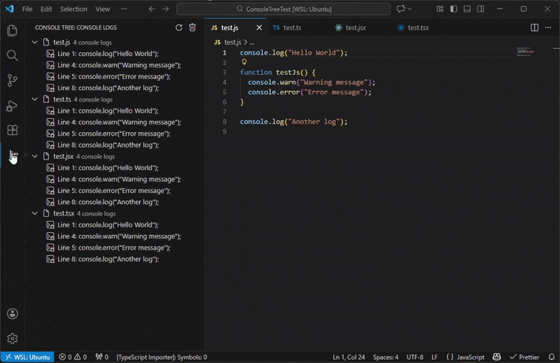

<a id="readme-top"></a>

<div align="center">


</div>

<h1 align="center">Console Tree</h1>

<div align="center">

[](https://marketplace.visualstudio.com/items?itemName=MarcosKlender.console-tree)
[](https://open-vsx.org/extension/MarcosKlender/console-tree)


Extension that provides a tree view to easily find, navigate, and remove console statements from your project.



</div>

## Table of Contents

  <ol>
    <li><a href="#features">Features</a></li>
    <li><a href="#installation">Installation</a></li>
    <li><a href="#usage">Usage</a></li>
    <li><a href="#configuration">Configuration</a></li>
    <li><a href="#supported-file-types">Supported File Types</a></li>
    <li><a href="#contributing">Contributing</a></li>
    <li><a href="#license">License</a></li>
    <li><a href="#acknowledgments">Acknowledgments</a></li>
  </ol>

## Features

🌳 **Tree View Interface** - Browse all console statements organized by files  
🔍 **Smart Detection** - Finds console.log, console.warn, console.error, console.info, and console.debug  
🎯 **Click to Navigate** - Jump directly to any console statement in your code  
🗑️ **One-Click Removal** - Remove individual console statements or all at once  
⚡ **Auto-Refresh** - Tree updates automatically when you modify files  
⚙️ **Configurable** - Customize file patterns and search patterns

<p align="right"><a href="#readme-top">Back to top ⬆️</a></p>

## Installation

### Visual Studio Code

Search for **"Console Tree"** in the Extensions panel or install directly from the [VS Code Marketplace](https://marketplace.visualstudio.com/items?itemName=MarcosKlender.console-tree).

### Cursor / Windsurf / VSCodium

Search for **"Console Tree"** in the Extensions panel or install directly from [Open VSX Registry](https://open-vsx.org/extension/MarcosKlender/console-tree).

### From Source

```bash
git clone https://github.com/MarcosKlender/ConsoleTree.git
cd ConsoleTree
pnpm install
pnpm run compile
```

Then press `F5` to test the extension.

<p align="right"><a href="#readme-top">Back to top ⬆️</a></p>

## Usage

1. Open a project in VSCode
2. Click on the **Console Tree** icon in the Activity Bar (Sidebar)
3. The tree view will show all `console statements` in your project organized by files
4. **Navigate**: Click on any console statement to jump to that line
5. **Remove individual**: Click the trash icon next to any console statement
6. **Remove all**: Click the trash icon in the tree view title bar
7. **Refresh**: Click the refresh icon to manually update the tree

<p align="right"><a href="#readme-top">Back to top ⬆️</a></p>

## Configuration

You can customize Console Tree in your VSCode Settings:

```json
{
  "consoleTree.includePatterns": [
    "**/*.js",
    "**/*.ts",
    "**/*.jsx",
    "**/*.tsx",
    "**/*.vue",
    "**/*.svelte"
  ],
  "consoleTree.excludePatterns": [
    "**/node_modules/**",
    "**/dist/**",
    "**/build/**",
    "**/*.min.js"
  ],
  "consoleTree.patterns": [
    "console\\.log\\s*\\(",
    "console\\.warn\\s*\\(",
    "console\\.error\\s*\\(",
    "console\\.info\\s*\\(",
    "console\\.debug\\s*\\("
  ]
}
```

<p align="right"><a href="#readme-top">Back to top ⬆️</a></p>

## Supported File Types

- JavaScript (`.js`, `.mjs`, `.cjs`)
- TypeScript (`.ts`)
- React (`.jsx`, `.tsx`)
- Vue.js (`.vue`)
- Svelte (`.svelte`)

<p align="right"><a href="#readme-top">Back to top ⬆️</a></p>

## Contributing

Contributions are welcome! Please feel free to submit a Pull Request.

1. Fork the repository
2. Create your feature branch
3. Commit your changes
4. Push to the branch
5. Open a Pull Request

<p align="right"><a href="#readme-top">Back to top ⬆️</a></p>

## License

This project is licensed under the MIT License - see the [LICENSE](LICENSE) file for details.

<p align="right"><a href="#readme-top">Back to top ⬆️</a></p>

## Acknowledgments

If you find this extension helpful and give credits, it would be greatly appreciated! Feel free to:

- ⭐ Star this repository
- 🐛 Report issues or suggest improvements
- 💬 Share your experience with the extension
- 🚀 Enjoy coding without console clutter

---

- Inspired by the popular [Todo Tree extension](https://github.com/Gruntfuggly/todo-tree)
- Made with ❤️ for the VS Code community!

<p align="right"><a href="#readme-top">Back to top ⬆️</a></p>
